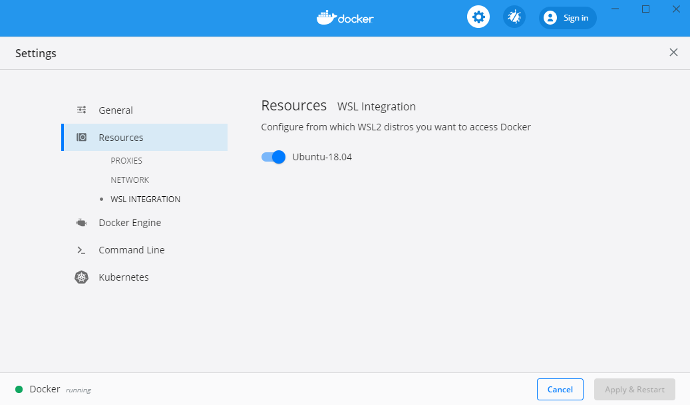

# Adrian's dev setup on Windows

I've tried to replicate my mac setup on Windows.

### Highlights

- WSL2 running Ubuntu 18.04
  - az-cli
  - ansible
  - docker
  - git
  - ssh-agent
  - terraform
  - z
  - zsh
    - oh my zsh
    - themes
    - fonts
    - prompt
- Chocolaty
- Windows Terminal
- PowerToys
- Docker Desktop
- VScode 
  - plugins


## Setting up Linux on Windows

1. WSL 2 is only available on Windows 10 builds 18917 or higher. In order to check your current Windows version run the following in PowerShell:
   ```
    PS C:\WINDOWS\system32> systeminfo | Select-String "^OS Name","^OS Version"
    OS Name:                   Microsoft Windows 10 Enterprise
    OS Version:                10.0.19041 N/A Build 19041   
   ```
   You can also join the [Windows Insider Program](https://insider.windows.com/en-us/) and select the 'Fast' ring or the 'Slow' ring.

1. Enable the feature by opening an Admin Powershell and typing:
    ```
    dism.exe /online /enable-feature /featurename:Microsoft-Windows-Subsystem-Linux /all /norestart
    dism.exe /online /enable-feature /featurename:VirtualMachinePlatform /all /norestart
    ```
    >:warning: Please restart your machine to finish the installation of both components.

1. My linux distribution of choice is Ubuntu 18.04 and it can installed also using and Admin PowerShell commands:
    ```
    cd ~/Desktop
    curl.exe -L -o ubuntu-1804.appx https://aka.ms/wsl-ubuntu-1804
    Add-AppxPackage .\ubuntu-1804.appx
    ```
    alternatively if you already have Chocolaty installed you can run:
    ```
    choco install wsl-ubuntu-1804
    ```

2. In case you already had a Linux distribution installed you can set it to be backed by WSL 2 using the command:
    ```
    wsl --set-version "Ubuntu-18.04" 2
    ```
    >:warning: Please be aware that this will take some time.
1. If the interoperability part anoyes you just disable it  by running 
    ```
    echo 0 > /proc/sys/fs/binfmt_misc/WSLInterop
    ```
    Although I find it nice to be able to edit with vscode. For those in need of [vim exit assitance there is a github](https://github.com/hakluke/how-to-exit-vim) with solutions :D

### Dealing with Linux internals

1. Azure CLI

    By far the simplest way to install is by executing:
    ```
    curl -sL https://aka.ms/InstallAzureCLIDeb | sudo bash
    ```
    The full TLDR can be found [here](https://docs.microsoft.com/en-us/cli/azure/install-azure-cli-apt?view=azure-cli-latest).

    1. Testing that it works simply do:
        ```
        az login
        ```
1. Installing Ansible
    ```
    sudo apt-add-repository ppa:ansible/ansible
    sudo apt-get update
    sudo apt-get install -y ansible
    ```

1. Docker
    ```
    sudo apt-get update
    sudo apt-get install -y apt-transport-https ca-certificates curl gnupg-agent software-properties-common
    curl -fsSL https://download.docker.com/linux/ubuntu/gpg | sudo apt-key add -
    sudo add-apt-repository "deb [arch=amd64] https://download.docker.com/linux/ubuntu $(lsb_release -cs) stable"
    sudo apt-get install -y docker-ce docker-ce-cli containerd.io
    sudo usermod -aG docker $USER
    ```

    Verifying that it works:
    ```
    docker version
    docker run hello-world
    ```
    Optional step for installing Docker Compose into your homedir:
    ```
    sudo apt-get update
    sudo apt-get install -y python3-pip
    pip3 install --user docker-compose
    ```
1. For `git` I've just placed a custom config in the repository. If you are planning to use that one make sure to change the user and email address.
    ```
    sudo apt-get install -y git
    ```
1. The simplest way I found to setup my ssh-agent was to use `keychain`
    Start by installing it:
    ```
    sudo apt-get install -y keychain
    ```
    And then add the following line to your .(bash|zsh)rc file:
    ```
    eval $(keychain --eval id_rsa --quiet)
    ```
    This will ask once for your password and then launch quently untill you restart in anyway your WSL VM.
1. Terraform

    In my case I have a bin directory in my $homedir so for getting TF to work what I needed to do was:
    ```
    mkdir -p ~/work/bin
    sudo apt-get update
    sudo apt-get install -y wget unzip
    wget https://releases.hashicorp.com/terraform/0.12.20/terraform_0.12.20_linux_amd64.zip -O /tmp/terraform_0.12.20_linux_amd64.zip
    unzip /tmp/terraform_0.12.20_linux_amd64.zip -d ~/work/bin
    rm /tmp/terraform_0.12.20_linux_amd64.zip
    ```
    And then add a line about the new $PATH in your .(bash|zsh)rc file:
    ```
    export PATH=$HOME/work/bin:$PATH
    ```
    After sourcing the rc file or opening a new tab executing `terraform -v` should output something like:
    ```
    terraform -v
    Terraform v0.12.20
    ```
1. By far my most favorite utility is [`z` which helps me navigate directories super fast](https://github.com/rupa/z/blob/master/z.sh).

    ```
    wget https://raw.githubusercontent.com/rupa/z/master/z.sh -O ~/work/bin/z.sh
    chmod +x ~/work/bin/z.sh
    ```
1. The last item on the list is zsh:
    ```
    sudo apt-get update
    sudo apt-get install -y zsh
    ```
    1. Install Oh My Zsh with:
    ```
    sh -c "$(curl -fsSL https://raw.githubusercontent.com/robbyrussell/oh-my-zsh/master/tools/install.sh)"
    ```
    2. Installing the Powerline fonts as mentioned [[here]](https://medium.com/@slmeng/how-to-install-powerline-fonts-in-windows-b2eedecace58).
    1. If everything was setup correctly we can proceed on installing the powerline10k theme
    ```
    git clone https://github.com/romkatv/powerlevel10k.git $ZSH_CUSTOM/themes/powerlevel10k
    ```
    Then edit your ~/.zshrc and set ZSH_THEME="powerlevel10k/powerlevel10k".
    Also add the following: POWERLEVEL9K_MODE="awesome-patched"
    Open a new terminal window and you will get prompted to run the config for your terminal. Alternatively run 
    ```
    p10k configure
    ```

## Installing Chocolatey

1. First, ensure that you are using an administrative PowerShell and check the **ExecutionPolicy** it's not set to restricted.
   - Run `Get-ExecutionPolicy`. If it returns `Restricted` execute:
        ```
        Set-ExecutionPolicy AllSigned
        ```
    - Now run the following command
        ```
        Set-ExecutionPolicy Bypass -Scope Process -Force; [System.Net.ServicePointManager]::SecurityProtocol = [System.Net.ServicePointManager]::SecurityProtocol -bor 3072; iex ((New-Object System.Net.WebClient).DownloadString('https://chocolatey.org/install.ps1'))
        ```

## Windows Terminal

1. It's time to install the preview version of Windows Terminal:
    ```
    choco install -f microsoft-windows-terminal
    ```
    Accept all script execution and wait for the installer to finish, or use the `update` verb to get the latest version.

2. In this repository I've added my modified config file `profiles.json` that will set a couple of things:
    - default terminal to Ubuntu
    - new columns/rows size
    - theme
    - font and font size
    - a couple of new shortcuts

## PowerToys

1. Simply install with:
    ```
    choco install -f powertoys  
    ```
    I'm mainly using it on my multi display setup to have a better split of the windows. Although it has other [interesting features](https://github.com/microsoft/PowerToys).
    

## Docker Desktop

1. Again using choco within an admin PowerShell and accept all script execution:
    ```
    choco install -f docker-desktop
    ```
2. To integrate with WSL2 the following two settings are necessary:

    Enable WSL2 and make sure the Docker daemon is not anymore exposed on localhost port 2375.
    

    And choose your distro
    

3. In my case I had already installed docker-desktop while running WSL1 and then WSL2 integration only started to work after runnin within ubuntu the commands:
    ```
    sudo find /usr -name "*docker*" -type l -exec rm {} +
    sudo find /usr -name "*Docker*" -type l -exec rm {} +
    sudo find /usr -name "*kube*" -type l -exec rm {} +
    ```

    >:warning: Another thing I had to removed from my `.zshrc` was the export of `DOCKER_HOST`
    ```
    export DOCKER_HOST=tcp://localhost:2375
    ```
## Visual Studio Code

1. Installing it is as simple as running:
    ```
    choco install -f vscode
    ```
2. And for extensions management from a PowerShell:
    ```
     code --list-extensions
     code --install-extension ms-vscode-remote.remote-wsl
     code --install-extension ms-vscode.azurecli
     code --install-extension davidanson.vscode-markdownlint
     code --install-extension ms-azuretools.vscode-docker
    ```
